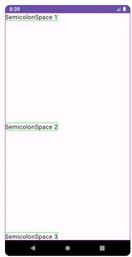
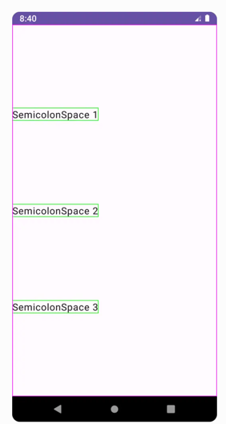
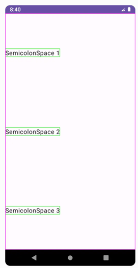

## Jetpack Compose Row, Column & Box (with Examples)
1. Row
   1. 相当于LinearLayout的垂直布局
2. Colum
   3. 相当于LinearLayout的水平布局
3. Box
   4. 相当于FrameLayout
4. Image
   1. 使用 ``` painterResource``` 传入图片的id
   2. contentDescription
## Jetpack Compose Alignment and Arrangement (with Examples)
1. Column
   1. Arrangement.SpaceBetween:

   2. Arrangement.SpaceEvenly:

   3. Arrangement.SpaceAround:

2. Row的情况可参考Column
3. Box,类似FrameLayout
## [Basics of Modifier] (https://semicolonspace.com/jetpack-compose-modifier/)
1. The Order of Modifier Functions Matters
   1. 修饰符需要注重修饰顺序，后者会对前者做修饰
2. Scope also Matters
   1. 需要注重父控件的作用域，不同作用域提供不同的修饰符
## [Padding, Margin, and Spacer] (https://semicolonspace.com/jetpack-compose-padding-margin/)
1. Modifier.padding(all: Dp)
2. Modifier.padding(horizontal: Dp = 0.dp, vertical: Dp = 0.dp)
3. Modifier.padding(start: Dp = 0.dp, top: Dp = 0.dp, end: Dp = 0.dp, bottom: Dp = 0.dp)
4. Modifier.padding(paddingValues: PaddingValues):
**note:** Compose中没有margin属性，而是使用padding来代替，修饰符的顺序不一样，从而可以达到margin的效果
***Spacer:***
1. 可以通过spacedBy()的方式来设置空白空间